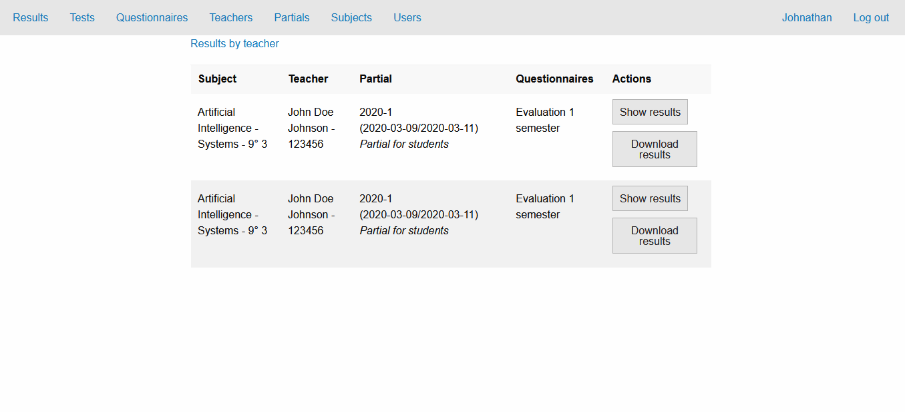
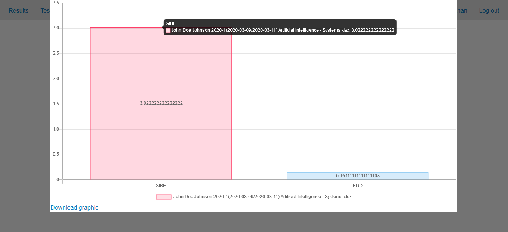
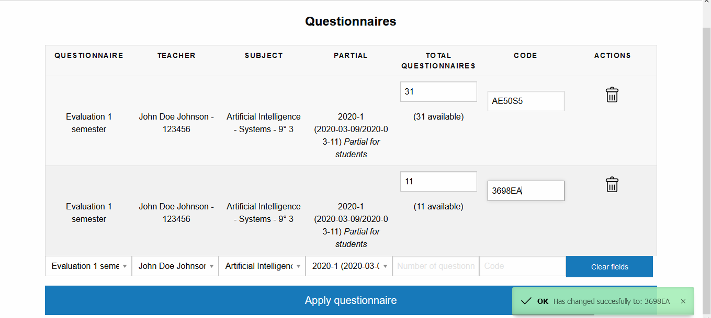
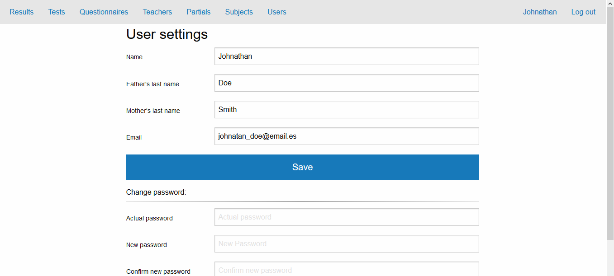
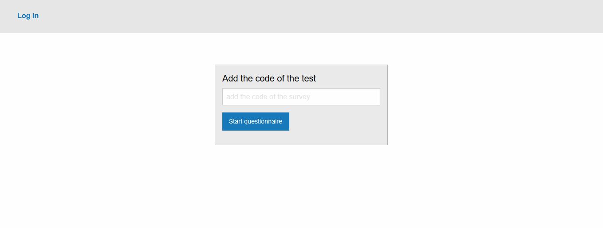
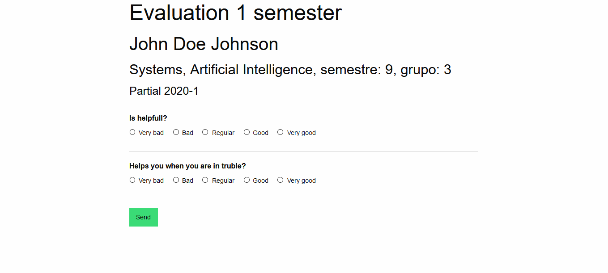
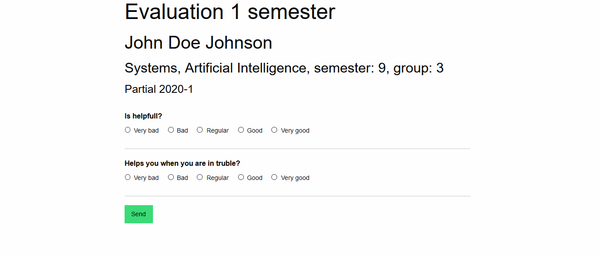

## Table of contents
* [General info](#general-info)
* [Technologies](#technologies)
* [Setup](#setup)

## General info
* This is a simple survey for schools so students can evaluate their teachers.
* This program allows you to add teachers to evaluate, users to administrate the content and surveys.
* You can download graphics with the result of the surveys.
* Answers are anonymous so students can be more honest when they are evaluating their teachers.
* Surveys require a code so the students does not try to trick to evaluate some else and the surveys have a limited number of surveys available.

## Technologies
This project is created with:
* PHP: 7.2
* MariaDB: 10.4.8
* Chart.js: 2.9.3
* chartjs-plugin-datalabels: 0.7.0
* jQuery: 3.4.1
* xlsx.js: 
* FileSaverjs: 2.0.2
* Foundation: 6.6.1

## Setup
This project requires that your PHP version supports the argon2i encryption for passwords.
This project also includes the default database with the superuser.

If you want to change the values in the graphics just search for this lines and add the values you would like to set:
```
let totalSIDE = ((totalTestValues/totalTest)*100)/150 ;
let totalEDD = ((totalTestValues/totalTest)*5)/150 ;
```

Adding the database use the command source inside mysql and add the path of the database. Example:
```
mysql> source C:/Users/John/Desktop/database.sql
```

* The default superuser enrollment is: 15
* The default superuser password is: moto

## Images







